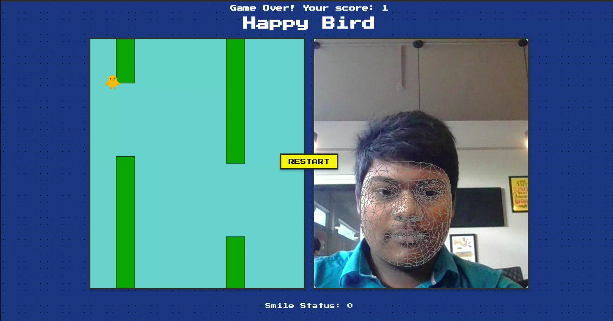

# 🐦 Happy Bird

> *Flappy Bird, but the bird only flies when you smile.*

Happy Bird is a feel-good twist on the classic Flappy Bird game. No tapping, no clicking — just smile to keep the bird in the air. Built with real-time face landmark detection and a machine learning pipeline, it's a simple yet powerful project that literally brings a smile to your face.

---



## How It Works

Your webcam feed is processed live using **MediaPipe Face Mesh**, which extracts 468 facial landmarks per frame. A subset of **lip landmarks** is fed into a **scikit-learn pipeline** (scaler + Random Forest classifier) trained to distinguish smiling from neutral/non-smiling expressions. The prediction is streamed to a browser-based Flappy Bird clone via **FastAPI** — smile and the bird flaps; stop smiling and it falls.

```
Webcam → OpenCV → MediaPipe Face Mesh → Lip Landmarks
    → sklearn Pipeline (StandardScaler + RandomForestClassifier)
        → Smile / No Smile
            → FastAPI → Flappy Bird (HTML/JS)
```

---

## Tech Stack

| Layer | Technology |
|---|---|
| Face landmark detection | MediaPipe Face Mesh |
| Smile classification | scikit-learn (Random Forest + Pipeline) |
| Video capture | OpenCV |
| Backend / API | FastAPI |
| Frontend game | HTML, CSS, JavaScript |

---

## Project Structure

```
Happy-Bird/
├── smile/                     # Training images — smiling faces
├── non_smile/                 # Training images — neutral faces
├── templates/                 # HTML frontend (the game)
├── face_detection.py          # MediaPipe landmark extraction
├── train.py                   # Dataset builder + model training
├── model.py                   # Pipeline definition
├── model.pkl                  # Trained and serialized model
├── lip_landmarks_dataset.csv  # Extracted landmark features
├── fast.py                    # FastAPI app + webcam inference loop
├── smile.mp4                  # Demo — smiling
└── nosmile.mp4                # Demo — not smiling
```

---

## Getting Started

**Prerequisites:** Python 3.8+, a webcam, and a working smile.

```bash
# Clone the repo
git clone https://github.com/RijoSLal/Happy-Bird.git
cd Happy-Bird

# Install dependencies
pip install fastapi uvicorn opencv-python mediapipe scikit-learn numpy

# Run the app
uvicorn fast:app --reload
```

Then open `http://localhost:8000` in your browser. Allow webcam access, face the camera, and smile to fly.

---

## Training the Model

If you want to retrain the classifier on your own data:

```bash
# Step 1: Extract landmarks from the smile/ and non_smile/ image folders
python face_detection.py

# Step 2: Train the Random Forest pipeline and save model.pkl
python train.py
```

The pipeline applies standard scaling before classification, keeping things clean and portable via a single `model.pkl` file.

---

## Why This Project?

Most ML demos are impressive but impersonal. Happy Bird flips that — the model isn't just running in the background, it's *you* controlling something in real time. It turns a smile into an input device, which makes the whole experience oddly delightful.

Simple stack. Real-time inference. Zero buttons required.

---

## License

MIT — fork it, smile at it, make it your own.
